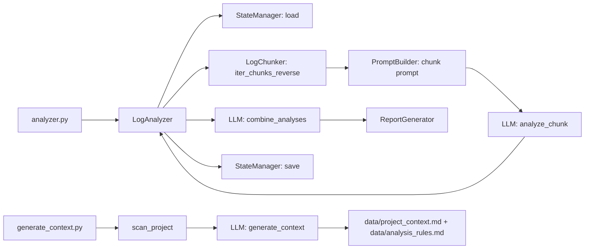

# Workflow

## Overview

The project operates in two phases:
1. **Context generation** from source code and docs.
2. **Log analysis** with LLM and report creation.

## Entry points

- `generate_context.py` — one‑time (or periodic) project context generation.
- `analyzer.py` — log analysis in manual or automatic mode.

## Phase 1: context generation (`generate_context.py`)

1. **Initialization**
   - Loads environment variables (`.env` or environment).
   - Initializes the LLM client (GLM).

2. **Project scan**
   - Reads files from `docs/` (if present).
   - Reads known files with size limits (configured in `FILE_LIMITS`).
   - Extracts imports and class/function signatures from Python files in `src/`.

3. **Prompt building**
   - Fills `prompts/{lang}/generate_context.txt` with collected content.
   - System message depends on the selected language.

4. **LLM call**
   - Sends the request to the LLM.
   - Splits the response into two documents by `===SEPARATOR===`.

5. **Saving**
   - `data/project_context.md`
   - `data/analysis_rules.md`

## Phase 2: log analysis (`analyzer.py`)

1. **Initialization**
   - Loads `.env` and `config.yaml`.
   - Creates the LLM client (GLM).
   - Creates `LogAnalyzer` (orchestrator).

2. **Context preparation**
   - `PromptBuilder` reads `data/project_context.md` and `data/analysis_rules.md`.
   - Loads prompt templates from `prompts/{lang}/`.

3. **Log reading**
   - `LogChunker` reads the log **from the end**, chunking by lines or tokens.
   - Supports rotated logs in `.zip`.
   - Honors `retention_days` and the checkpoint in `data/state.json`.

4. **Chunk analysis**
   - Builds a prompt for each chunk (`analyze_chunk.txt`).
   - Runs LLM analysis; collects metrics and results.
   - Stops on limits (`num_chunks`, `max_cost_usd`).

5. **Combine results**
   - LLM call with `create_report.txt` or `create_report_with_anomalies.txt`.
   - LLM performs deduplication, trend detection, and anomaly detection.

6. **Report and checkpoint**
   - `ReportGenerator` saves JSON and Markdown reports.
   - `StateManager` saves the new checkpoint (`data/state.json`).

## Run modes

- **Manual**: single analysis run, results saved immediately.
- **Auto**: endless loop, repeats every `check_interval_hours`.

## Component interactions

## Lifecycle of the main task

1. The user configures `config.yaml` and `.env`.
2. Runs `generate_context.py` to get the base context.
3. Runs `analyzer.py` in manual or auto mode.
4. The system reads recent logs, analyzes, combines, and saves the report.
5. The next run continues from the last checkpoint.
