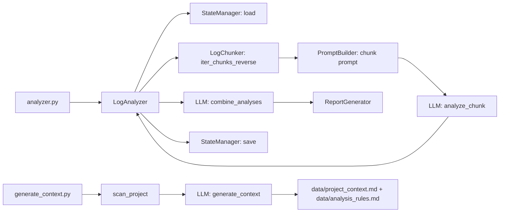

# Workflow

## Общее описание

Проект работает в двух фазах:
1. **Генерация контекста** по исходному коду и документации.
2. **Анализ логов** с использованием LLM и формированием отчета.

## Точки входа

- `generate_context.py` — единоразовая (или периодическая) генерация контекста проекта.
- `analyzer.py` — запуск анализа логов в ручном или автоматическом режиме.

## Фаза 1: генерация контекста (`generate_context.py`)

1. **Инициализация**
   - Загружаются переменные окружения (`.env` или окружение).
   - Инициализируется LLM‑клиент (GLM).

2. **Сканирование проекта**
   - Читаются файлы из `docs/` (если есть).
   - Читаются известные файлы с лимитами по длине (настройка в `FILE_LIMITS`).
   - По Python‑файлам из `src/` извлекаются импорты и сигнатуры функций/классов.

3. **Формирование запроса**
   - Шаблон `prompts/{lang}/generate_context.txt` наполняется собранным контентом.
   - Системное сообщение зависит от выбранного языка.

4. **Вызов LLM**
   - Отправка запроса в LLM.
   - Ответ делится на два документа по маркеру `===SEPARATOR===`.

5. **Сохранение**
   - `data/project_context.md`
   - `data/analysis_rules.md`

## Фаза 2: анализ логов (`analyzer.py`)

1. **Инициализация**
   - Загрузка `.env` и `config.yaml`.
   - Создание LLM‑клиента (GLM).
   - Создание `LogAnalyzer` (оркестратор).

2. **Подготовка контекста**
   - `PromptBuilder` читает `data/project_context.md` и `data/analysis_rules.md`.
   - Загружает шаблоны промптов из `prompts/{lang}/`.

3. **Чтение логов**
   - `LogChunker` читает лог **с конца**, чанкуя по строкам или токенам.
   - Поддерживается ротация логов в `.zip`.
   - Учитывается `retention_days` и чекпоинт из `data/state.json`.

4. **Анализ чанков**
   - Для каждого чанка строится промпт (`analyze_chunk.txt`).
   - Выполняется LLM‑анализ; собираются метрики и результаты.
   - Останавливается при достижении лимитов (`num_chunks`, `max_cost_usd`).

5. **Объединение результатов**
   - Запрос к LLM с `create_report.txt` или `create_report_with_anomalies.txt`.
   - LLM выполняет дедупликацию, тренды и аномалии.

6. **Отчет и чекпоинт**
   - `ReportGenerator` сохраняет JSON и Markdown отчет.
   - `StateManager` сохраняет новый чекпоинт (`data/state.json`).

## Режимы запуска

- **Manual**: один запуск анализа, результаты сразу сохраняются.
- **Auto**: бесконечный цикл, повторяется каждые `check_interval_hours`.

## Взаимодействие компонентов

## Жизненный цикл основной задачи

1. Пользователь настраивает `config.yaml` и `.env`.
2. Запускает `generate_context.py`, получает базовый контекст.
3. Запускает `analyzer.py` в manual или auto режиме.
4. Система читает свежие логи, анализирует, комбинирует и сохраняет отчет.
5. Следующий запуск продолжает с последнего чекпоинта.
